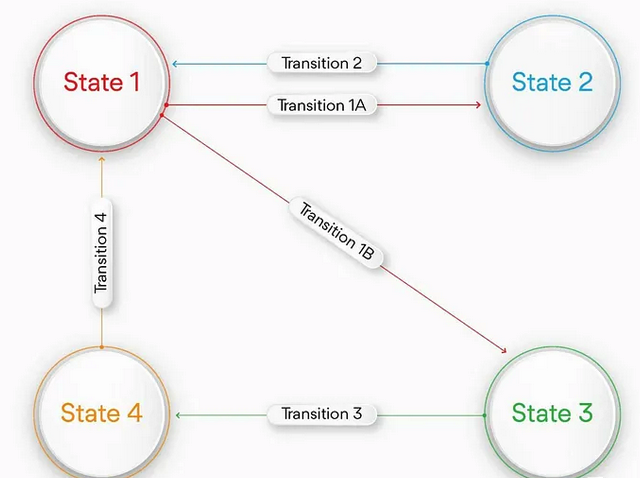

    
    <h1> React-TypeScript Form Wizard </h1>

This repository was created with the intention of providing developers with a
sample of working with the development pattern [State](https://refactoring.guru/design-patterns/state)
in order to create a Form Wizard.

The State Machine is used to define and manage the different states and transitions
of a component. Instead of using variables and conditionals to handle state, it
defines a set of states and determines how to transition from one state to another
based on occurring events.